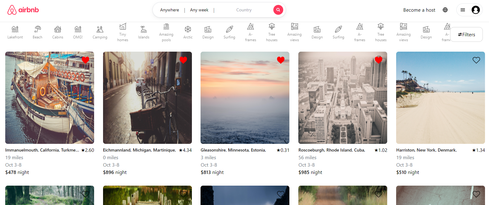
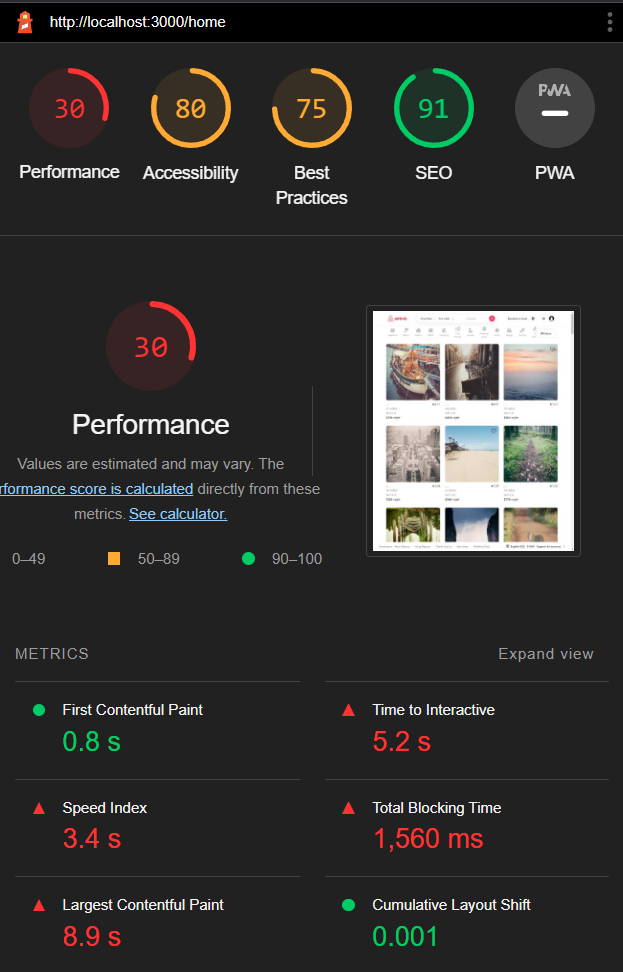
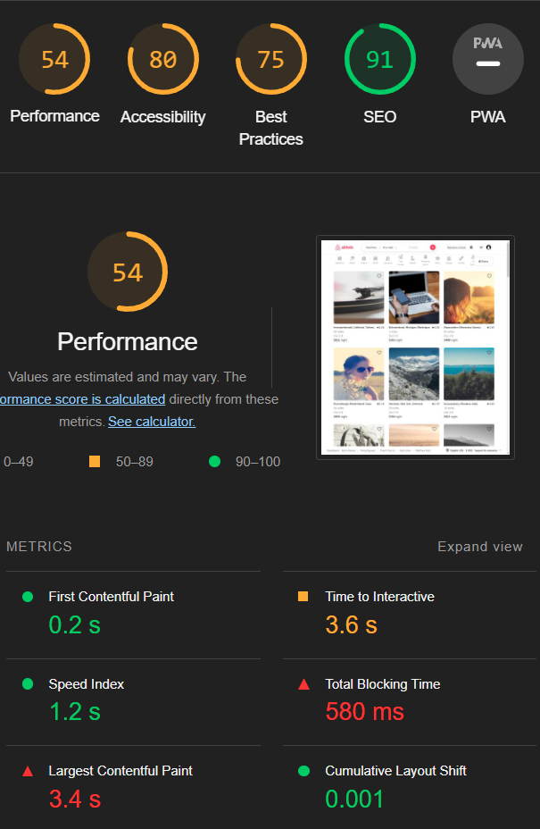

# Airbnb Clone

## Table of contents

- [Overview](#overview)
  - [The challenge](#the-challenge)
  - [Screenshot](#screenshot)
  - [Links](#links)
- [Our process](#our-process)
  - [Built with](#built-with)
  - [What We learned](#what-we-learned)
- [Optomization](#optomization)

Do it yourself -

Fork and clone down the repo

      npm install
      //gets all dependencies
      npm run dev
      //starts the node server
      npm run start:dev
      //starts the react front end server

## Overview

### The challenge

Users should be able to:

- Veiw homes that were fetched from the psql database
- Click on a home to view additional details about a property
- Filter homes by propery type
- Add favorite homes to a wishlist, saved in local state, view on the /wishlist page

### Screenshot

### Links

- Live URL - [Airbnb-Clone](https://a-team-airbnb-clone-static.onrender.com)

## Our Process

### Built with

- [React](https://reactjs.org/) - JS library
- [Tailwind](https://tailwindcss.com/) - JS library
- [GraphQL](https://graphql.org/) - Querying
- [Express](https://expressjs.com/) - Node library
- [MongoDB](https://www.mongodb.com/) - Database
- [Mongoose](https://mongoosejs.com/) - Database Library

### What we learned

In this project, we learned how to efficiently work together as a team, and how to efficiently integrate
git into our work-flow. We ran into merge conflicts as expected and communicated often to resolve
them. We figured out how to fix issues related to saving state between renders, using custom hooks,
and local storage. In addition to how to dynamically change API routes, depending on the environment.
We learned about the differences of regular CSS and Tailwind, and how Tailwind is shorter and
more simple to use. It was trivial to figure out how to get the server and database configured correctly
in order to be compatible with Render. Successful deployment was a huge win, because the path to
getting there was a challenge. We are proud of this project because we made it with all our efforts.

### Optomization

Itinially the application had poor performance due to lengthy load times for database information and network calls for pictures. I changed the database from Postgres to MongoDB and refactored the app to use graphQL instead of REST APIs. I utilized a library to make image loading more efficient, mainly by only loading images when they are scrolled to on screen. App performance was improved by 80% and time to interactive was decreased by 30%

